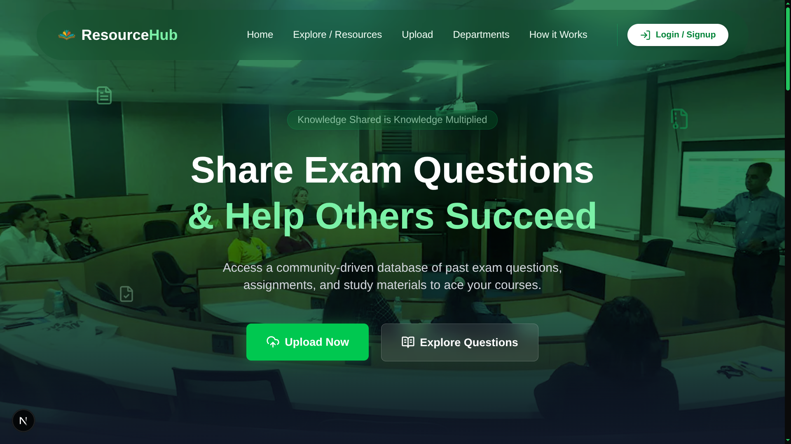
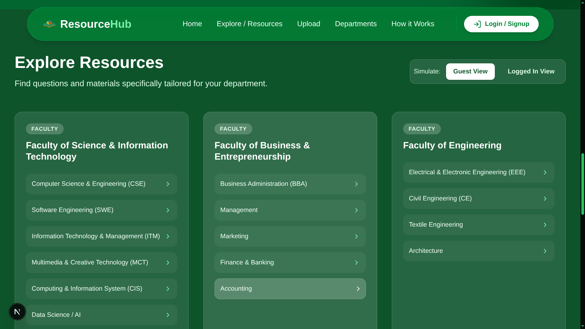
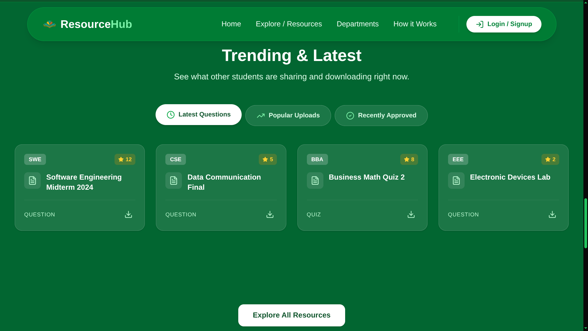
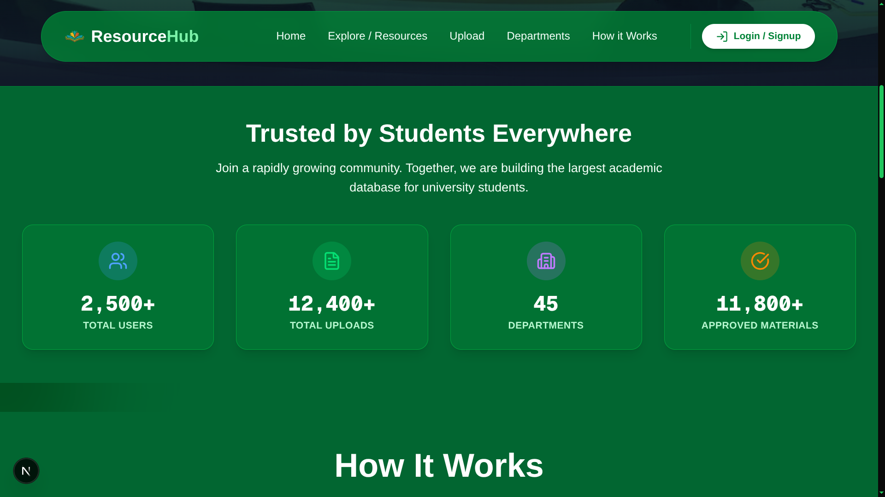
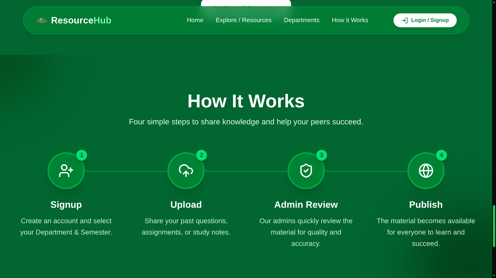

<div align="center">
<h1><b>Resource Hub 🎓</b> </h1> 
</div>
A modern, community-driven web platform designed for university students to easily share and access past exam questions, assignments, and study materials. Built with a focus on premium UI/UX, fast performance, and seamless navigation.

## Features ✨

- **Premium UI/UX:** A stunning, modern interface with a glassmorphism design system and dynamic green-themed color palettes.
  <br/>

- **Scroll Animations:** Smooth left/right staggered scroll animations powered by Framer Motion that trigger both scrolling down and up.
- **Categorized Department Browsing:** Tailored specifically for university faculties (e.g., DIU) allowing students to filter resources strictly by their department.
  <br/>

- **Trending & Latest Uploads:** Discover what other students are actively sharing with simulated popularity metrics, tabs, and likes.
  <br/>

- **Interactive Stats:** Trust-building animated counters showing community growth.
  <br/>

- **How It Works:** A clear, step-by-step guide explaining the platform's process.
  <br/>

- **Responsive Design:** Fully mobile-optimized layout with fixed horizontal overflow issues.

## Tech Stack 🛠️

- **Framework:** [Next.js](https://nextjs.org/) (App Router)
- **Styling:** [Tailwind CSS](https://tailwindcss.com/)
- **Animations:** [Framer Motion](https://www.framer.com/motion/)
- **Icons:** [Lucide React](https://lucide.dev/)

## Getting Started 🚀

1. **Clone the repository**
   ```bash
   git clone https://github.com/atul-dev-ai/resource-hub.git
   ```
   ```bash
   cd resource-hub
   ```

2. **Install dependencies**
   ```bash
   npm install
   ```

3. **Run the development server**
   ```bash
   npm run dev
   ```

4. **Open the App**
   Navigate to [http://localhost:3000](http://localhost:3000) in your browser.

## License & Usage

This project is open-source under the MIT License.

You are free to use and contribute, but you must give proper credit to the original author.

Re-uploading, rebranding, or presenting this project as your own work without attribution is strictly prohibited.

## Contributing 🤝

Contributions, issues, and feature requests are welcome!
